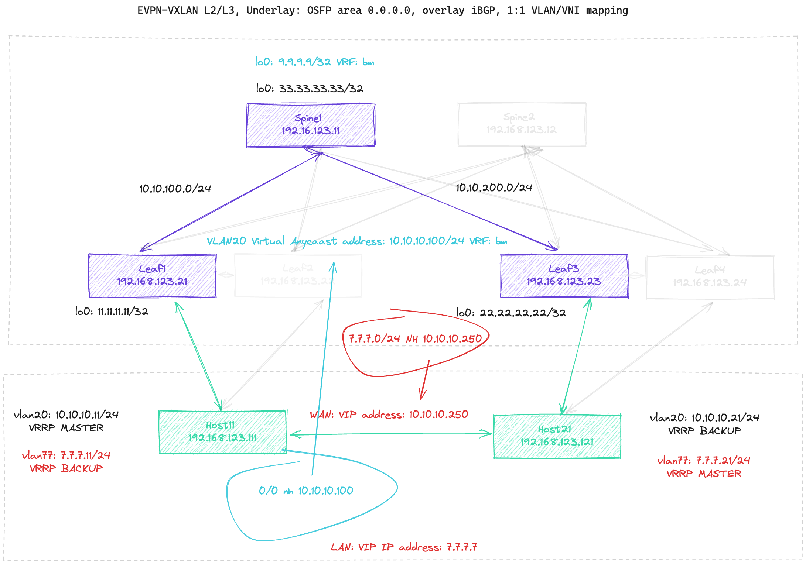

# EVPN-VxLAN HSRP/VRRP FW cluster dual-attached / Geo-stretched


## Getting Started

  - [Overview](#overview)
  - [Lab Requirements](#lab-requirements)
  - [Lab Topology](#lab-topology)
  - [How To Use Start](#how-to-start)
  - [Devices Configs](#devices-configs)
  - [Results](#Results)

### Overview

The primary goal of this repository is to simulate setup with Firewall Cluster geo-stretched, connected to two separated VTEPs, i.e. localized in separate DC1 & DC2. Lab is using **[Containerlab](https://containerlab.srlinux.dev/)** and cEOS, a containerized version of Arista's EOS software. This setup, which can be brought to life on any machine equipped with Docker, takes only a few minutes. It serves as a valuable resource for learning, testing various Arista EOS features, and in some cases, even for crafting configurations suitable for production environments, OFC with the limitation to hardware-specific features.


### Lab Requirements

A machine with Docker CE or Docker Desktop is required.
Following operating systems were tested:

 - The lab is expected to run on any major Linux distribution with Docker installed
 - Hardware requirements depend on the number of containers deployed. For toplogies  of 10+ cEOS containers 8 vCPUs and 16 GB RAM are recommended.
 - cEOS image. Go to section [Download cEOS image](#Download-cEOS-image) to find out how to do it

> **WARNING**: Please make sure that your host has enough resorces. Otherwise Containerlab can enter "frozen" state and require Docker / host restart.

To install Docker on a Linux machine, please check [this guide](https://docs.docker.com/engine/install).


## Download cEOS image

Please remember to download Arista cEOS image and import it to your local docker images repository. You need to have account on arista.com site. The most convient way is to install using... Yes, you are right! We surely use a dockeraized downloader. Firstly, please generate Download Token on your Arista account and export it as env variable `$ARISTA_TOKEN`, then use eos-downlader [eos-downlader](https://github.com/titom73/eos-downloader), as presented below:

```bash
[ ApiusLAB 🧪 ] # ardl --token $ARISTA_TOKEN get eos --image-type cEOS64 --release-type M --latest --log-level debug --output ./
🪐 eos-downloader is starting...
    - Image Type: cEOS64
    - Version: None
🔎  Searching file cEOS64-lab-4.30.4M.tar.xz
    -> Found file at /support/download/EOS-USA/Active Releases/4.30/EOS-4.30.4M/cEOS-lab/cEOS64-lab-4.30.4M.tar.xz
💾  Downloading cEOS64-lab-4.30.4M.tar.xz ━━━━━━━━━━━━━━━━━━━━━━━━━━━━━━━━━━━━━━━━━━━━━━━━━━━━━━━━━━━━━━━━━━━━━━━━━━━━━━━━━━━━━━━━━━━━━━━━━━━━━━━━━━━━━━━━━━━━━━━━━━━ 100.0% • 11.6 MB/s • 571.8/571.8 MB • 0:00:42 •
🚀  Running checksum validation
🔎  Searching file cEOS64-lab-4.30.4M.tar.xz.sha512sum
    -> Found file at /support/download/EOS-USA/Active Releases/4.30/EOS-4.30.4M/cEOS-lab/cEOS64-lab-4.30.4M.tar.xz.sha512sum
💾  Downloading cEOS64-lab-4.30.4M.tar.xz.sha512sum ━━━━━━━━━━━━━━━━━━━━━━━━━━━━━━━━━━━━━━━━━━━━━━━━━━━━━━━━━━━━━━━━━━━━━━━━━━━━━━━━━━━━━━━━━━━━━━━━━━━━━━━━━━━━━━━━━━━━━━━━━━ 100.0% • ? • 155/155 bytes • 0:00:00 •
✅  Downloaded file is correct.
✅  processing done !
```

And import it:

```
[ ApiusLAB 🧪 ] # docker import cEOS64-lab-4.30.4M.tar.xz ceos64:4.30.4M
sha256:488618b63f2c075496655babfea48341045bdfed3871ccd96af1ac38189bab7d
```

### Lab Topology
The lab setup diagram:



In this setup, we have the most basic S&L topology consisting of two distinct ToR VTEPs: LEAF1 and LEAF3, along with a single spine switch: SPINE1. Attached to these leaf switches are two host machines that simulate collectively as a single logical device, floating IP based on VRRP. These hosts form an quasi HA FW cluster, operating in Active/Standby mode and are geographically distributed across two data centers. The goal is to evaluate impact that a master switch-over might have on EVPN-VxLAN resilience time. Additionally, we aim to explore the distribution of a static route, which targets floating IP addresses on the active FW node, downside the EVPN-VxLAN topology.

## How To Start

Deploy a gien topology using container lab docker image with additional parameters which makes it writeable to local volumen and accessible over the host network.

```bash
docker run --rm -it --privileged \
    --network host \
    -v /var/run/docker.sock:/var/run/docker.sock \
    -v /var/run/netns:/var/run/netns \
    -v /etc/hosts:/etc/hosts \
    -v /var/lib/docker/containers:/var/lib/docker/containers \
    --pid="host" \
    -v $(pwd):$(pwd) \
    -w $(pwd) \
    ghcr.io/srl-labs/clab deploy -t clab.yml
```

'clab.yml' file consits a topology/lab definition in yaml format and scheme readlable for containerlab:

```bash
name: evpn_vxlan_fw

mgmt:
  network: custom_mgmt
  ipv4-subnet: 192.168.123.0/24
  ipv4-gw: 192.168.123.1
  external-access: true

topology:
  kinds:
    ceos:
      image: ceos64:4.30.4M
  defaults:
    kind: ceos
  nodes:
    spine1:
      mgmt-ipv4: 192.168.123.11
      startup-config: init-configs/spine1.cfg
    leaf1:
      mgmt-ipv4: 192.168.123.21
      startup-config: init-configs/leaf1.cfg
    leaf3:
      mgmt-ipv4: 192.168.123.23
      startup-config: init-configs/leaf3.cfg
    host11:
      mgmt-ipv4: 192.168.123.111
      startup-config: init-configs/host11.cfg
    host21:
      mgmt-ipv4: 192.168.123.121
      startup-config: init-configs/host21.cfg

  links:
  - endpoints: ["spine1:eth1_1", "leaf1:eth49_1"]
  - endpoints: ["spine1:eth3_1", "leaf3:eth49_1"]
  - endpoints: ["host11:eth1", "leaf1:eth1_1"]
  - endpoints: ["host21:eth1", "leaf3:eth1_1"]
  - endpoints: ["host11:eth5", "host21:eth5"]
```

Finally you should see a inspection output as follows:

```bash
INFO[0000] Parsing & checking topology file: avd_lab.clab.yml 
+---+---------------------+--------------+----------------+------+---------+--------------------+--------------+
| # |        Name         | Container ID |     Image      | Kind |  State  |    IPv4 Address    | IPv6 Address |
+---+---------------------+--------------+----------------+------+---------+--------------------+--------------+
| 1 | clab-avd_lab-host11 | 48f4bcb376b7 | ceos64:4.30.4M | ceos | running | 192.168.123.111/24 | N/A          |
| 2 | clab-avd_lab-host21 | ef2f6399c5bf | ceos64:4.30.4M | ceos | running | 192.168.123.121/24 | N/A          |
| 3 | clab-avd_lab-leaf1  | d265eb48f894 | ceos64:4.30.4M | ceos | running | 192.168.123.21/24  | N/A          |
| 4 | clab-avd_lab-leaf3  | c96bf02522fe | ceos64:4.30.4M | ceos | running | 192.168.123.23/24  | N/A          |
| 5 | clab-avd_lab-spine1 | 184cf066ba96 | ceos64:4.30.4M | ceos | running | 192.168.123.11/24  | N/A          |
| 6 | clab-avd_lab-spine2 | 7d78a4b222f9 | ceos64:4.30.4M | ceos | running | 192.168.123.12/24  | N/A          |
+---+---------------------+--------------+----------------+------+---------+--------------------+--------------+
```
### Devices configs

EVPN-VxLAN configuration based on OSPF, flat Area 0 as UNDERLAY LAYER routing protocol, (similar configuration for LEAF1, LEAF3 and SPINE1)

```bash
router ospf 1
   router-id 11.11.11.11
   auto-cost reference-bandwidth 400000
   passive-interface Loopback0
   max-lsa 0
   timers spf delay initial 0 200 200
   timers lsa rx min interval 0
   timers lsa tx delay initial 0 200 200
   timers out-delay 800
!
interface Loopback0
   ip address 11.11.11.11/32
   ip ospf area 0.0.0.0
!
interface Ethernet49/1
   no switchport
   ip address 10.10.200.11/24
   ip ospf network point-to-point
   ip ospf area 0.0.0.0
```

OVERLAY is based o BGP EVPN signalisation, here we have full-mesh topology regarding that we have only 3 devices:

```bash
router bgp 65010
   router-id 11.11.11.11
   neighbor PEER peer group
   neighbor PEER remote-as 65010
   neighbor PEER update-source Loopback0
   neighbor PEER send-community extended
   neighbor 22.22.22.22 peer group PEER
   neighbor 33.33.33.33 peer group PEER
   !
   vlan 20
      rd auto
      route-target both 65010:100020
      redistribute learned
   !
   address-family evpn
      neighbor PEER activate
   !
   address-family ipv4
      neighbor PEER activate
   !
   vrf bm
      rd 65010:11.11.11.11
      route-target import evpn 100:203900
      route-target export evpn 100:203900
      redistribute connected
      redistribute static
!
```

VLAN TO VNI mapping is simple, we have only one vlan and one L2 vrf: bm:

```bash
!
interface Vxlan1
   vxlan source-interface Loopback0
   vxlan udp-port 4789
   vxlan vlan 20 vni 100020
   vxlan vrf bm vni 203900
!
```

To make sure that we have recursive static route to 7.7.7.0/24 (poiting to floating VRRP address: 10.10.10.250) dstributed to the rest of the EVPN fabric, orgin only from the leaf directly conected to currently active (MASTER) node we add some additional configuration:

```bash
!
router general
   vrf bm
      route static next-hop resolution ribs system-connected
!
```

## How To Start

Let's find out how it works:

on Host11 and Host21 we have configuration where WAN (vl20) and LAN (vl77), as follows:

```bash
host11(config)#sh vrrp brief 
Interface VRF        ID  Ver Pri Time  State  Last Transition     VR IP Addresses 
--------- ---------- --- --- --- ----- ------ ------------------- ---------------
Vl20      default    1   3   253 3010  Master 01:16:26 ago        10.10.10.250    
Vl77      default    7   3   250 3020  Backup 01:48:21 ago        7.7.7.7    
```

From Leafs perspective it looks accordingly, Leaf1:

```bash
leaf1# sh ip route vrf bm

VRF: bm
(...)
Gateway of last resort is not set

 S        7.7.7.0/24 [1/0] via 10.10.10.250, Vlan20
 B I      9.9.9.9/32 [200/0] via VTEP 33.33.33.33 VNI 203900 router-mac 00:1c:73:36:20:36 local-interface Vxlan1
 B I      10.10.10.21/32 [200/0] via VTEP 22.22.22.22 VNI 203900 router-mac 00:1c:73:19:04:a5 local-interface Vxlan1
 C        10.10.10.0/24 is directly connected, Vlan20

```

and Leaf3:

```bash
leaf3# sh ip route vrf bm

VRF: bm
(...)

Gateway of last resort is not set

 B I      7.7.7.0/24 [200/0] via VTEP 11.11.11.11 VNI 203900 router-mac 00:1c:73:9d:f9:e9 local-interface Vxlan1
 B I      9.9.9.9/32 [200/0] via VTEP 33.33.33.33 VNI 203900 router-mac 00:1c:73:36:20:36 local-interface Vxlan1
 B I      10.10.10.11/32 [200/0] via VTEP 11.11.11.11 VNI 203900 router-mac 00:1c:73:9d:f9:e9 local-interface Vxlan1
 B I      10.10.10.250/32 [200/0] via VTEP 11.11.11.11 VNI 203900 router-mac 00:1c:73:9d:f9:e9 local-interface Vxlan1
 C        10.10.10.0/24 is directly connected, Vlan20

leaf3#
```
Where 7.7.7.0/24 is a netowrk behing FW (LAN), and 9.9.9.9/32 is a additional loopback on Spine site for conectivity testing purpose.

As you can see, Leaf 3 gets GW address (10.10.10.250) and destined routing 7.7.7.0/24 over EVPN from 11.11.11.11 VTEP which is loopback adress of LEAF1. It is right with the Mastership of VRRP group1 on "WAN" interfaces of our quasi FW cluster.

Let's switch over the mastership and compare outputs. Firstly, I downgrade priority on Leaf1:

```bash
host11(config)#int vlan20
host11(config-if-Vl20)#sh ac
interface Vlan20
   ip address 10.10.10.11/24
   vrrp 1 priority-level 253
   vrrp 1 ipv4 10.10.10.250
   vrrp 1 ipv4 version 3
host11(config-if-Vl20)#vrrp 1 priority-level 190
host11(config-if-Vl20)#sh vrrp brief 
Interface VRF        ID  Ver Pri Time  State  Last Transition     VR IP Addresses 
--------- ---------- --- --- --- ----- ------ ------------------- ---------------
Vl20      default    1   3   190 3250  Backup 00:00:01 ago        10.10.10.250    
Vl77      default    7   3   250 3020  Backup 01:59:53 ago        7.7.7.7         
host11(config-if-Vl20)#
```

The WAN side swap the position of active node, so then let's check how the Leafs have reacted for changes. As You can expect, now we have localy active routes on Leaf3 which advertise these to Leaf1:

```bash
leaf3#sh ip route vrf bm

VRF: bm
(...))

Gateway of last resort is not set

 S        7.7.7.0/24 [1/0] via 10.10.10.250, Vlan20
 B I      9.9.9.9/32 [200/0] via VTEP 33.33.33.33 VNI 203900 router-mac 00:1c:73:36:20:36 local-interface Vxlan1
 B I      10.10.10.11/32 [200/0] via VTEP 11.11.11.11 VNI 203900 router-mac 00:1c:73:9d:f9:e9 local-interface Vxlan1
 C        10.10.10.0/24 is directly connected, Vlan20

leaf3#
```

and oposit situation right now on Leaf1:
```bash
leaf1(config-router-general-vrf-bm)#sh ip route vrf bm

VRF: bm
(...)
Gateway of last resort is not set

 B I      7.7.7.0/24 [200/0] via VTEP 22.22.22.22 VNI 203900 router-mac 00:1c:73:19:04:a5 local-interface Vxlan1
 B I      9.9.9.9/32 [200/0] via VTEP 33.33.33.33 VNI 203900 router-mac 00:1c:73:36:20:36 local-interface Vxlan1
 B I      10.10.10.21/32 [200/0] via VTEP 22.22.22.22 VNI 203900 router-mac 00:1c:73:19:04:a5 local-interface Vxlan1
 B I      10.10.10.250/32 [200/0] via VTEP 22.22.22.22 VNI 203900 router-mac 00:1c:73:19:04:a5 local-interface Vxlan1
 C        10.10.10.0/24 is directly connected, Vlan20

```

To makes thing clear, let's check if we have all these routes correctly advertised and accepted on SPINE1:

```bash
spine1#sh ip route vrf bm

VRF: bm
(...)

Gateway of last resort is not set

 B I      7.7.7.0/24 [200/0] via VTEP 22.22.22.22 VNI 203900 router-mac 00:1c:73:19:04:a5 local-interface Vxlan1
 C        9.9.9.9/32 is directly connected, Loopback1
 B I      10.10.10.11/32 [200/0] via VTEP 11.11.11.11 VNI 203900 router-mac 00:1c:73:9d:f9:e9 local-interface Vxlan1
 B I      10.10.10.21/32 [200/0] via VTEP 22.22.22.22 VNI 203900 router-mac 00:1c:73:19:04:a5 local-interface Vxlan1
 B I      10.10.10.250/32 [200/0] via VTEP 22.22.22.22 VNI 203900 router-mac 00:1c:73:19:04:a5 local-interface Vxlan1
 B I      10.10.10.0/24 [200/0] via VTEP 22.22.22.22 VNI 203900 router-mac 00:1c:73:19:04:a5 local-interface Vxlan1

spine1#
```

As you might have expected, we have a complete set of routing paths. Let's check if all endpoints are reachable:

```bash
spine1#ping vrf bm 7.7.7.7 repeat 1
PING 7.7.7.7 (7.7.7.7) 72(100) bytes of data.
80 bytes from 7.7.7.7: icmp_seq=1 ttl=63 time=16.5 ms

--- 7.7.7.7 ping statistics ---
1 packets transmitted, 1 received, 0% packet loss, time 0ms
rtt min/avg/max/mdev = 16.466/16.466/16.466/0.000 ms


spine1#ping vrf bm 7.7.7.11 repeat 1
PING 7.7.7.11 (7.7.7.11) 72(100) bytes of data.
80 bytes from 7.7.7.11: icmp_seq=1 ttl=63 time=10.8 ms

--- 7.7.7.11 ping statistics ---
1 packets transmitted, 1 received, 0% packet loss, time 0ms
rtt min/avg/max/mdev = 10.818/10.818/10.818/0.000 ms


spine1#ping vrf bm 7.7.7.21 repeat 1
PING 7.7.7.21 (7.7.7.21) 72(100) bytes of data.
80 bytes from 7.7.7.21: icmp_seq=1 ttl=63 time=6.66 ms

--- 7.7.7.21 ping statistics ---
1 packets transmitted, 1 received, 0% packet loss, time 0ms
rtt min/avg/max/mdev = 6.656/6.656/6.656/0.000 ms


spine1#ping vrf bm 10.10.10.100 repeat 1
PING 10.10.10.100 (10.10.10.100) 72(100) bytes of data.
80 bytes from 10.10.10.100: icmp_seq=1 ttl=65 time=4.19 ms

--- 10.10.10.100 ping statistics ---
1 packets transmitted, 1 received, 0% packet loss, time 0ms
rtt min/avg/max/mdev = 4.185/4.185/4.185/0.000 ms


spine1#ping vrf bm 10.10.10.101 repeat 1
PING 10.10.10.101 (10.10.10.101) 72(100) bytes of data.

--- 10.10.10.101 ping statistics ---
1 packets transmitted, 0 received, 100% packet loss, time 0ms

spine1#ping vrf bm 10.10.10.11 repeat 1
PING 10.10.10.11 (10.10.10.11) 72(100) bytes of data.
80 bytes from 10.10.10.11: icmp_seq=1 ttl=63 time=9.93 ms

--- 10.10.10.11 ping statistics ---
1 packets transmitted, 1 received, 0% packet loss, time 0ms
rtt min/avg/max/mdev = 9.928/9.928/9.928/0.000 ms


spine1#ping vrf bm 10.10.10.21 repeat 1
PING 10.10.10.21 (10.10.10.21) 72(100) bytes of data.
80 bytes from 10.10.10.21: icmp_seq=1 ttl=63 time=4.65 ms

--- 10.10.10.21 ping statistics ---
1 packets transmitted, 1 received, 0% packet loss, time 0ms
rtt min/avg/max/mdev = 4.653/4.653/4.653/0.000 ms


spine1#ping vrf bm 10.10.10.250 repeat 1
PING 10.10.10.250 (10.10.10.250) 72(100) bytes of data.
80 bytes from 10.10.10.250: icmp_seq=1 ttl=63 time=5.08 ms

--- 10.10.10.250 ping statistics ---
1 packets transmitted, 1 received, 0% packet loss, time 0ms
rtt min/avg/max/mdev = 5.084/5.084/5.084/0.000 ms
```


The last test is to find out how many packets/pings we loose during switchover process. We ping 7.7.7.7 from VRF: bm at SPINE1 and at the same time we get back to VRRP MASTER on HOST11:

```bash
spine1#ping vrf bm 7.7.7.7 repeat 1000000
PING 10.10.10.250 (10.10.10.250) 72(100) bytes of data.
80 bytes from 10.10.10.250: icmp_seq=1 ttl=63 time=26.0 ms
80 bytes from 10.10.10.250: icmp_seq=2 ttl=63 time=15.9 ms
80 bytes from 10.10.10.250: icmp_seq=3 ttl=63 time=7.84 ms
80 bytes from 10.10.10.250: icmp_seq=4 ttl=63 time=38.0 ms
80 bytes from 10.10.10.250: icmp_seq=5 ttl=63 time=16.6 ms
(...)
```

```bash
host11(config-if-Vl20)#sh vrrp brief
Interface VRF        ID  Ver Pri Time  State  Last Transition     VR IP Addresses 
--------- ---------- --- --- --- ----- ------ ------------------- ---------------
Vl20      default    1   3   190 3250  Backup 00:18:34 ago        10.10.10.250    
Vl77      default    7   3   250 3020  Backup 02:18:25 ago        7.7.7.7         
host11(config-if-Vl20)#vrrp 1 priority-level 253

(wait a second...)

host11(config-if-Vl20)#sh vrrp brief
Interface VRF        ID  Ver Pri Time  State  Last Transition     VR IP Addresses 
--------- ---------- --- --- --- ----- ------ ------------------- ---------------
Vl20      default    1   3   253 3010  Master 00:00:02 ago        10.10.10.250    
Vl77      default    7   3   250 3020  Backup 02:18:43 ago        7.7.7.7         
host11(config-if-Vl20)#
```

The result on SPINE1 is very promissing. We lost only 1 ping!

```bash
(...)
80 bytes from 10.10.10.250: icmp_seq=156 ttl=63 time=18.8 ms
80 bytes from 10.10.10.250: icmp_seq=157 ttl=63 time=12.0 ms

--- 10.10.10.250 ping statistics ---
158 packets transmitted, 157 received, 0.632911% packet loss, time 3964ms
rtt min/avg/max/mdev = 5.026/21.208/85.098/13.112 ms, pipe 3, ipg/ewma 25.246/18.087 ms
spine1#
```
